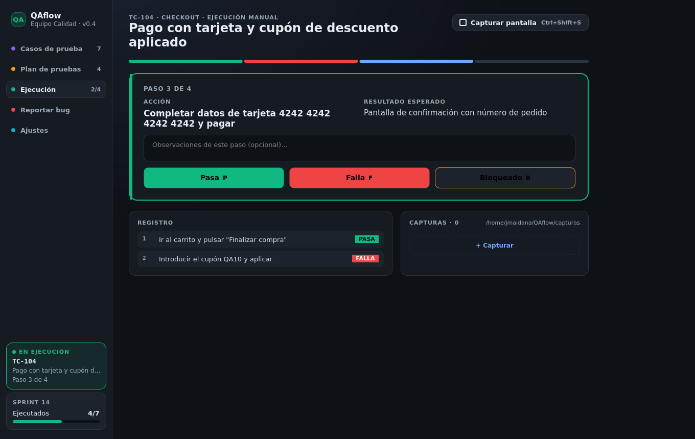
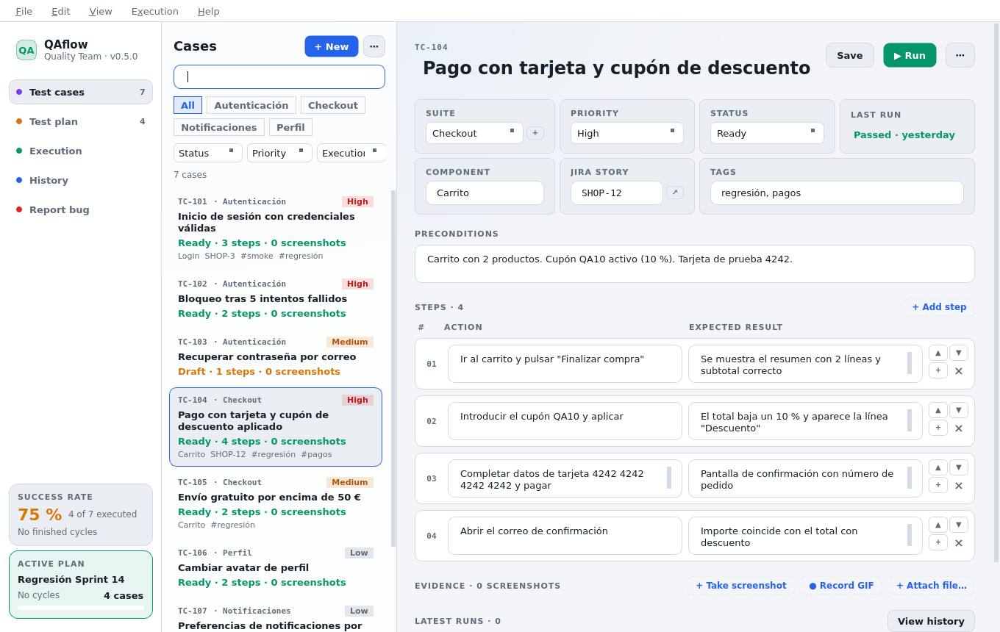

# QAflow

Aplicación de escritorio para equipos de QA: casos de prueba, plan de regresión, ejecución
manual paso a paso con evidencias (capturas anotadas, grabaciones GIF, logs y vídeos adjuntos) y reporte de bugs a
Jira, GitHub, GitLab o Azure DevOps. Qt 6 Widgets · C++20.



Interfaz en español o inglés, tema oscuro o claro, menú con atajos estándar e icono en la bandeja del sistema.
Navegación en un rail de iconos al estilo de los IDE de JetBrains (el nombre y el atajo, en el tooltip) y barra de
estado con la ejecución en curso, la tasa de éxito y el plan activo.

## Requisitos

* CMake ≥ 3.16
* Qt 6 (Core, Gui, Widgets, Network, Test) — probado con Qt 6.4 y 6.7
* Opcional: Qt LinguistTools (`lrelease`) para incrustar la traducción al inglés; sin él la app se compila sólo en español
* Compilador C++20 (GCC 12+, Clang 15+, MSVC 2022)
* Opcional (Linux): QtDBus (viene con Qt) para capturar y registrar el atajo global en **Wayland** a través de
  `xdg-desktop-portal`; `libx11-dev` y `libxcb1-dev` para el atajo global en **X11**. Sin ellos la app compila y
  Ajustes indica que el atajo sólo funciona con la ventana en primer plano
* Opcional (Linux/X11): `xdotool` para el modo de captura «Ventana activa»
* Opcional (Linux): `secret-tool` (paquete libsecret-tools) para guardar el token del gestor en el llavero; sin él queda en el fichero de ajustes y la app lo avisa

## Compilar y ejecutar

```bash
cmake -S . -B build -DCMAKE_BUILD_TYPE=Release
cmake --build build -j
./build/qaflow
```

Tests (un ejecutable por clase, etiquetados por capa; los de UI usan la plataforma `offscreen`):

```bash
ctest --test-dir build --output-on-failure
ctest --test-dir build -L core             # modelos y funciones puras
ctest --test-dir build -L application      # stores y servicios sobre repositorios en memoria
ctest --test-dir build -L infrastructure   # JSON en disco, QSettings, clientes REST contra un servidor HTTP falso
ctest --test-dir build -L presentation     # ventana principal completa (menú, atajos, toasts)
```

## Paquetes y CI

```bash
cpack --config build/CPackConfig.cmake      # .deb y .tar.gz (Linux), instalador NSIS y .zip (Windows), .dmg (macOS)
packaging/linux/build-appimage.sh build     # AppImage (descarga linuxdeploy si hace falta)
```

`.github/workflows/ci.yml` compila y pasa los tests en Linux, Windows y macOS en cada push, genera los paquetes
como artefactos y, en los tags `v*`, los adjunta a la release de GitHub.

## Atajos

| Atajo                | Acción                              |
|----------------------|-------------------------------------|
| Ctrl+N               | Nuevo caso                          |
| Ctrl+F               | Buscar caso                         |
| Ctrl+D               | Duplicar caso                       |
| Ctrl+Z               | Deshacer el último borrado          |
| F5                   | Ejecutar el caso seleccionado       |
| Ctrl+Shift+S         | Capturar pantalla (configurable; global, funciona sin el foco en la app; una segunda pulsación cancela la cuenta atrás) |
| Ctrl+Shift+G         | Iniciar o detener la grabación de GIF (configurable, global) |
| Ctrl+Alt+P           | Pasa el paso actual y avanza al siguiente (configurable, global) |
| Ctrl+Alt+F           | Falla el paso actual y avanza al siguiente (configurable, global) |
| Ctrl+Alt+A           | Vuelve al paso anterior (configurable, global) |
| Ctrl+Shift+A         | Adjuntar archivos como evidencia (o arrastrarlos a la ventana) |
| Clic en una miniatura | Abrir la evidencia a tamaño completo (← → navegan, Ctrl+E anota, Ctrl+C copia) |
| Ctrl+B               | Reportar bug                        |
| Ctrl+1 … Ctrl+5      | Cambiar de pantalla                 |
| Ctrl+,               | Abrir los ajustes                   |
| P / F / B / S        | Veredicto del paso en ejecución     |
| Ctrl+Q               | Salir                               |

## Pantallas

| Pantalla          | Qué hace                                                                   |
|-------------------|----------------------------------------------------------------------------|
| Casos de prueba   | Lista filtrable por suite, estado, prioridad, última ejecución y texto (título, ID, etiquetas, componente, historia); editor con suites nuevas, etiquetas, componente, enlace a historia de Jira, pasos reordenables e insertables y sus últimas ejecuciones, cada una con un clic para abrir sus resultados en el historial (las evidencias son de cada ejecución y se ven allí); duplicar y eliminar con confirmación y deshacer; importar y exportar en JSON, CSV y Markdown |
| Planes            | Varios planes (crear, duplicar, archivar, eliminar), casos en orden de ejecución propio, progreso del ciclo actual con enlace a su informe, estimación basada en las duraciones reales del historial (3 min/paso si no hay datos) y arranque de un ciclo nuevo |
| Ejecución         | Tres columnas: el caso con su progreso y la lista de pasos (veredicto corregible en cada uno), el paso actual con Pasa / Falla / Bloq. / N/A (teclas P / F / B / S), paso anterior (Retroceso), **atajos globales** para avanzar de paso sin volver a la ventana (Ctrl+Alt+P / Ctrl+Alt+F / Ctrl+Alt+A), cronómetro por paso y por caso, visor grande de la evidencia elegida con «Asignar a» y observaciones, y la columna de capturas con las evidencias de esta ejecución. Sobrevive al cierre de la aplicación |
| Historial         | Ejecuciones archivadas (pasos, resultados, notas, duración y sus evidencias, con lo que está enlazado en Jira y Zephyr), informes de plan con exportación a Markdown y publicación en Zephyr y panel de métricas: tasa de éxito por suite y evolución entre ciclos |
| Reportar bug      | Formulario prellenado con el paso fallido y campos reales del gestor (tipo, prioridad, asignado, componentes, versión, etiquetas) cargados del proyecto, con las personas buscadas en Jira según se escribe; crea el issue en Jira, GitHub, GitLab o Azure DevOps y sube las capturas; lista de bugs reportados con su estado y cola offline con reintento |
| Ajustes (ventana) | Se abre desde «Archivo → Ajustes» (Ctrl+,), en su propia ventana: idioma (español / inglés / sistema), tema (oscuro / claro / sistema), cerrar a la bandeja; atajos de la ejecución; gestor de incidencias (Jira, GitHub, GitLab o Azure DevOps: URL, proyecto, modo de autenticación en Jira y credenciales en el llavero del sistema), publicación de ciclos en Zephyr y preferencias de captura (atajos de captura y grabación, formato, modo, retardo, carpeta, atajo global, editor tras capturar, copia al portapapeles, fps y duración del GIF) |

## Conexión con Jira

QAflow habla la **API REST v2**, la que sirven tanto Jira Cloud como Jira Server / Data Center. En Ajustes
se elige cómo autenticarse:

| Modo                                  | Credenciales             | Para                                                          |
|---------------------------------------|--------------------------|---------------------------------------------------------------|
| Jira Cloud · correo y API token       | correo + API token       | `https://empresa.atlassian.net`, con un token de id.atlassian.com |
| Jira Server · usuario y contraseña    | usuario + contraseña     | Jira Server / Data Center, **incluida la 8.5.1**, que aún no tiene tokens personales |
| Jira Server · token personal (PAT)    | token personal           | Jira Server / Data Center 8.14 o superior                     |

En Server la URL es la de la instancia con su context path si lo tiene (`https://jira.empresa.com` o
`https://empresa.com/jira`) y las personas se identifican por su nombre de usuario, no por `accountId`.
La contraseña se guarda en el llavero del sistema, igual que los tokens. Si Jira bloquea al usuario tras
varios intentos fallidos, «Probar conexión» lo dice: hay que entrar una vez por el navegador y resolver
el CAPTCHA antes de que vuelva a aceptar la API.

## Zephyr: publicar los ciclos en Jira

Si el proyecto usa **Zephyr for Jira** para los ciclos de prueba, QAflow los rellena solo: al terminar
un ciclo de plan, «Publicar en Zephyr» crea el *test cycle* con una ejecución por caso, el veredicto de
cada paso y las evidencias colgadas donde corresponde — las de un paso en su resultado y las del caso
en la ejecución.

**Un caso, un Test.** Como el caso se ejecuta muchas veces y en varios planes, su issue de tipo
**Test** es siempre el mismo: el campo «Test de Zephyr» del editor lo enlaza (`SHOP-42`) y todos los
ciclos se publican sobre él. Ese campo se rellena una vez, y de dos maneras: pegando la clave de un
Test que ya exista, o pulsando **«Crear»**, que lo estrena en Jira con el título, las precondiciones y
los pasos del caso y anota su clave. El caso que llegue a la publicación sin Test lo estrena ahí
mismo, y la aplicación enumera antes cuáles van a estrenarlo. Al terminar, si algo se ha quedado fuera
—un Test que Jira rechazó, una evidencia que ya no está en disco o los veredictos que sobran cuando el
Test tiene menos pasos que el caso— lo detalla con su motivo en vez de limitarse a contarlo.

Publicado el ciclo, el informe del plan lo recuerda: enseña «Publicado en Zephyr el … · ciclo N» y, si
se pide publicarlo otra vez, avisa de que Zephyr creará un ciclo nuevo en vez de actualizar aquél.
Además, cada caso del informe —y el detalle de cada ejecución— muestra con qué está enlazado: su
historia de Jira y su Test de Zephyr, en chips que abren el issue en el navegador. El Markdown
exportado lo lleva también, para que el informe pegado en un ticket se explique solo.

Se activa en Ajustes, bajo el gestor de incidencias: usa la misma instancia y las mismas credenciales
de Jira, y allí se indican la versión del proyecto a la que van los ciclos y el tipo de incidencia con
el que se crean los Tests (`Test` salvo en un Jira traducido, donde se llame de otra manera). La API se busca en las dos rutas por las que Zephyr la sirve, así que funciona tanto con la
**ZAPI** pública (incluida de fábrica desde Zephyr 5.6) como con la del propio plugin
(`/rest/zephyr/latest`), que es lo único que hay en las versiones anteriores como la **5.3**.

| Veredicto de QAflow | Estado en Zephyr |
|---------------------|------------------|
| Pasa                | PASS (1)         |
| Falla               | FAIL (2)         |
| Bloqueado           | BLOCKED (4)      |
| N/A                 | sin ejecutar (-1)|

## Evidencias

Las evidencias son **de la ejecución**, no del caso: se capturan ejecutando y se ven en la ejecución
—en la propia pantalla de Ejecución mientras dura, y después en su ficha del historial y en el informe
del plan, donde se abren, se anotan y se copian—. Por eso, sin una ejecución en curso, capturar avisa
en vez de guardar nada, y la pantalla de Casos no tiene galería. Al publicar el ciclo en Zephyr, cada
ejecución sube las suyas.

* **Captura** (`Ctrl+Shift+S`): pantalla completa, ventana activa o región, con **retardo** opcional (3, 5 o 10 s con
  cuenta atrás en pantalla) para abrir menús o tooltips. El atajo es **global**: se registra en el sistema
  (`RegisterHotKey` en Windows, `XGrabKey` en X11, portal `GlobalShortcuts` en Wayland, Carbon en macOS) y funciona
  aunque QAflow esté en la bandeja. Si el sistema lo rechaza, Ajustes lo indica y el atajo sigue funcionando con la app en primer plano.
* **Wayland**: las capturas van por `xdg-desktop-portal` (interfaz `Screenshot`), porque `QScreen::grabWindow`
  devuelve negro. «Ventana activa» abre el selector del compositor; «Región» recorta sobre la captura del portal.
* **Editor de anotaciones**: flechas, rectángulos, elipses, marcador, texto y **difuminado** (pixelado) de datos
  sensibles, con colores, grosor y deshacer. Se abre desde la miniatura (✎), el visor o, si se activa en Ajustes,
  automáticamente tras cada captura. Guardar sustituye el fichero.
* **Visor a tamaño completo**: clic en cualquier miniatura; navegación entre las evidencias de la ejecución, zoom,
  arrastre, copiar al portapapeles, anotar y mostrar en la carpeta.
* **Adjuntar ficheros existentes** (logs, vídeos, HAR, imágenes…): botón «Adjuntar archivo», `Ctrl+Shift+A` o
  arrastrándolos a la ventana. Se copian a la carpeta de capturas, se asignan al paso en ejecución y se suben al
  gestor con el bug como cualquier captura.
* **Grabación de GIF** (`Ctrl+Shift+G`): pantalla completa o región, con control flotante (tiempo, Detener, Esc
  cancela), fps y duración máxima configurables. Codificador GIF propio (median cut + LZW), sin dependencias.
  No disponible en Wayland (el portal no ofrece captura continua sin PipeWire).
* **Copiar al portapapeles**: desde el visor, el menú contextual de la miniatura o automáticamente tras cada captura (Ajustes).
* **Sin volver a la ventana**: mientras se prueba otra aplicación, `Ctrl+Alt+P` y `Ctrl+Alt+F` dan el veredicto del paso y pasan al
  siguiente, y `Ctrl+Alt+A` vuelve al anterior; las capturas siguientes se asignan solas al paso nuevo. Son atajos del sistema, como
  el de captura, y avisan en la bandeja de en qué paso ha quedado la ejecución. Se configuran en Ajustes.

## Dónde se guardan los datos

* Casos, planes, historial y ejecución en curso: directorio de datos de la aplicación (`~/.local/share/QAflow/QAflow/` en Linux).
* Ajustes: `~/.config/QAflow/QAflow.conf`. El token del gestor va al llavero del sistema (secret-tool en Linux, Keychain en macOS, DPAPI en Windows).
* Bugs reportados y cola de envíos pendientes: `bugs.json` en el directorio de datos.
* Capturas: carpeta configurable, por defecto `~/QAflow/capturas`.

En el primer arranque se cargan casos de ejemplo. Si un guardado falla (disco lleno, sin permisos) la app lo avisa
con un botón «Reintentar» y mantiene los cambios en memoria hasta que se pueda escribir.



## Arquitectura

Ver [docs/architecture.md](docs/architecture.md).
